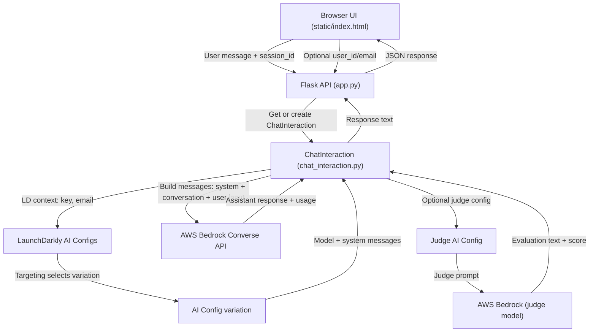

# App Flow Diagram

This diagram shows the end-to-end request flow from the web UI to LaunchDarkly
AI Configs and AWS Bedrock, including targeting and prompt assembly.

## Key Data Elements

- **session_id**: Used to identify chat sessions in memory.
- **user_id / email**: Optional context fields sent to LaunchDarkly for targeting.
- **system messages**: Loaded from the AI Config variation and prepended to the
  conversation for the Bedrock call.
- **user message**: The input text from the UI.
- **assistant response**: The model output returned to the UI.
- **judge evaluation (optional)**: A second model call that scores the response.
