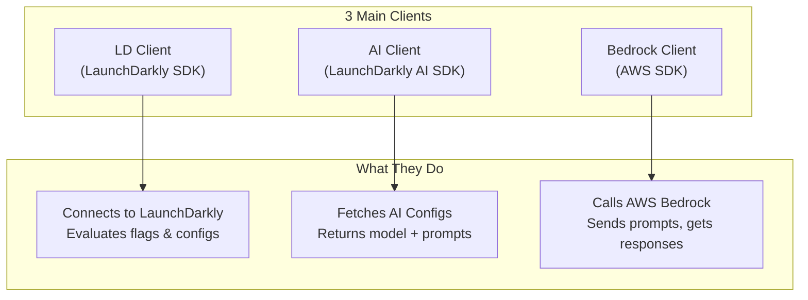
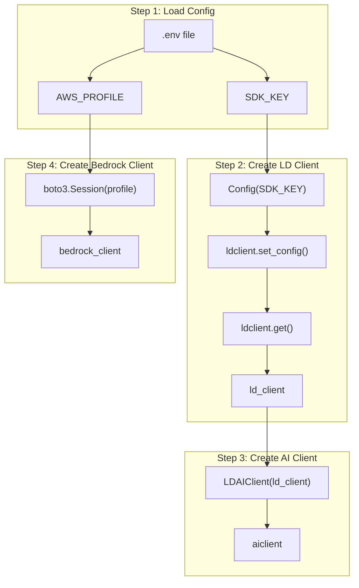
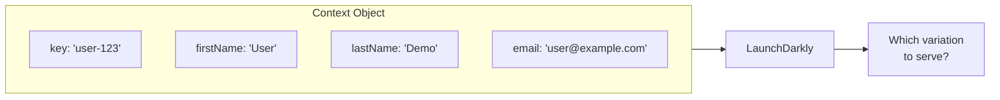
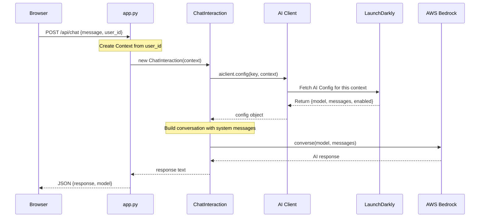

# Clients & Context Flow Explained

This document explains the various clients used in this app, how they connect, and how data flows through them. Written for beginners.

---

## Table of Contents

1. [Python Packages Required](#python-packages-required)
2. [The 3 Main Clients](#the-3-main-clients)
3. [How Clients Are Created](#how-clients-are-created)
4. [What is Context?](#what-is-context)
5. [Complete Flow Diagram](#complete-flow-diagram)
6. [Step-by-Step Walkthrough](#step-by-step-walkthrough)
7. [Code Reference with Line Numbers](#code-reference-with-line-numbers)

---

## Python Packages Required

Install these via `pip install -r requirements.txt`:

| Package | Purpose | Import Statement |
|---------|---------|------------------|
| `launchdarkly-server-sdk` | Core LaunchDarkly SDK | `import ldclient` |
| `launchdarkly-server-sdk-ai` | AI Configs SDK extension | `from ldai.client import LDAIClient` |
| `boto3` | AWS SDK for Python (Bedrock) | `import boto3` |
| `flask` | Web server | `from flask import Flask` |
| `python-dotenv` | Load `.env` file | `from dotenv import load_dotenv` |

---

## The 3 Main Clients



### Simple Explanation

| Client | What It Does | Lives In |
|--------|--------------|----------|
| **LD Client** | Connects to LaunchDarkly servers using your SDK key | `chat_interaction.py` line 31 |
| **AI Client** | Wraps LD Client to fetch AI Configs (model, prompts) | `chat_interaction.py` line 32 |
| **Bedrock Client** | Connects to AWS to call AI models | `chat_interaction.py` line 39-42 |

---

## How Clients Are Created



### Code Breakdown

```python
# chat_interaction.py

# Step 1: Load environment variables
load_dotenv()
LD_SDK_KEY = os.getenv("LAUNCHDARKLY_SDK_KEY")

# Step 2: Create LaunchDarkly Client
ldclient.set_config(Config(LD_SDK_KEY))  # Line 30
ld_client = ldclient.get()                # Line 31

# Step 3: Create AI Client (wraps LD Client)
aiclient = LDAIClient(ld_client)          # Line 32

# Step 4: Create Bedrock Client (called on demand)
def get_bedrock_client():
    session = boto3.Session(profile_name=AWS_PROFILE)
    return session.client('bedrock-runtime', region_name=AWS_REGION)
```

---

## What is Context?

**Context** tells LaunchDarkly WHO is making the request. It's used for:
- **Targeting** — serve different variations to different users
- **Experiments** — split traffic for A/B tests
- **Analytics** — track metrics per user

### Context Structure



### How Context is Created

```python
# app.py lines 25-29

user_context = Context.builder(resolved_user_id) \
    .set("firstName", "User") \
    .set("lastName", "Demo") \
    .set("email", resolved_email) \
    .build()
```

### Why Context Matters

| Attribute | Used For |
|-----------|----------|
| `key` (user_id) | Unique identifier for targeting rules |
| `email` | Target by email domain or pattern |
| Custom attributes | Any business logic (plan, region, etc.) |

---

## Complete Flow Diagram



---

## Step-by-Step Walkthrough

### 1️⃣ App Starts

```
┌─────────────────────────────────────────────────┐
│  chat_interaction.py loads at import time       │
├─────────────────────────────────────────────────┤
│  1. load_dotenv() → reads .env file             │
│  2. ldclient.set_config() → connects to LD      │
│  3. LDAIClient(ld_client) → AI client ready     │
└─────────────────────────────────────────────────┘
```

### 2️⃣ User Sends Message

```
┌─────────────────────────────────────────────────┐
│  Browser sends POST /api/chat                   │
├─────────────────────────────────────────────────┤
│  {                                              │
│    "message": "Hello",                          │
│    "session_id": "session-123",                 │
│    "user_id": "john",                           │
│    "email": "john@example.com"                  │
│  }                                              │
└─────────────────────────────────────────────────┘
```

### 3️⃣ Context is Built

```
┌─────────────────────────────────────────────────┐
│  app.py builds Context from request data        │
├─────────────────────────────────────────────────┤
│  Context {                                      │
│    key: "john",                                 │
│    email: "john@example.com",                   │
│    firstName: "User",                           │
│    lastName: "Demo"                             │
│  }                                              │
└─────────────────────────────────────────────────┘
```

### 4️⃣ AI Config is Fetched

```
┌─────────────────────────────────────────────────┐
│  AI Client asks LaunchDarkly for config         │
├─────────────────────────────────────────────────┤
│  aiclient.config(                               │
│    "chat-assistant-config",  ← config key       │
│    user_context,             ← who is asking    │
│    fallback_value            ← if LD is down    │
│  )                                              │
├─────────────────────────────────────────────────┤
│  LaunchDarkly returns:                          │
│  {                                              │
│    enabled: true,                               │
│    model: { name: "amazon.nova-pro-v1:0" },     │
│    messages: [                                  │
│      { role: "system", content: "You are..." } │
│    ]                                            │
│  }                                              │
└─────────────────────────────────────────────────┘
```

### 5️⃣ Bedrock is Called

```
┌─────────────────────────────────────────────────┐
│  ChatInteraction calls AWS Bedrock              │
├─────────────────────────────────────────────────┤
│  bedrock_client.converse(                       │
│    modelId: "amazon.nova-pro-v1:0",             │
│    system: [{ text: "You are helpful..." }],    │
│    messages: [                                  │
│      { role: "user", content: "Hello" }         │
│    ]                                            │
│  )                                              │
├─────────────────────────────────────────────────┤
│  Bedrock returns:                               │
│  {                                              │
│    output: {                                    │
│      message: {                                 │
│        content: [{ text: "Hi! How can I help?"  │
│      }                                          │
│    },                                           │
│    usage: { inputTokens: 20, outputTokens: 8 }  │
│  }                                              │
└─────────────────────────────────────────────────┘
```

### 6️⃣ Response Sent Back

```
┌─────────────────────────────────────────────────┐
│  Flask returns JSON to browser                  │
├─────────────────────────────────────────────────┤
│  {                                              │
│    "response": "Hi! How can I help?",           │
│    "model": "amazon.nova-pro-v1:0",             │
│    "session_id": "session-123"                  │
│  }                                              │
└─────────────────────────────────────────────────┘
```

---

## Code Reference with Line Numbers

### chat_interaction.py

| Line | Code | Purpose |
|------|------|---------|
| 16 | `import ldclient` | Import LD SDK |
| 17 | `from ldclient import Context` | Import Context builder |
| 19 | `from ldai.client import LDAIClient` | Import AI Client |
| 30 | `ldclient.set_config(Config(LD_SDK_KEY))` | Initialize LD connection |
| 31 | `ld_client = ldclient.get()` | Get LD client instance |
| 32 | `aiclient = LDAIClient(ld_client)` | Create AI Client |
| 39-42 | `get_bedrock_client()` | Create Bedrock client |
| 66-70 | `aiclient.config(...)` | Fetch AI Config |
| 154 | `bedrock_client.converse(...)` | Call AWS Bedrock |

### app.py

| Line | Code | Purpose |
|------|------|---------|
| 9 | `from ldclient import Context` | Import Context |
| 25-29 | `Context.builder(...).build()` | Build user context |
| 31 | `ChatInteraction(user_context, ...)` | Pass context to chat |

---

## Summary Cheat Sheet

```
┌────────────────────────────────────────────────────────────┐
│                    CLIENTS CHEAT SHEET                     │
├────────────────────────────────────────────────────────────┤
│                                                            │
│  LD Client     →  Connects to LaunchDarkly                 │
│       ↓                                                    │
│  AI Client     →  Fetches AI Configs (model + prompts)     │
│       ↓                                                    │
│  Bedrock Client →  Calls AWS AI model                      │
│                                                            │
├────────────────────────────────────────────────────────────┤
│                                                            │
│  Context = WHO is making the request                       │
│  AI Config = WHAT model/prompt to use                      │
│  Bedrock = WHERE the AI runs                               │
│                                                            │
└────────────────────────────────────────────────────────────┘
```

---

*Last updated: Feb 2026*
