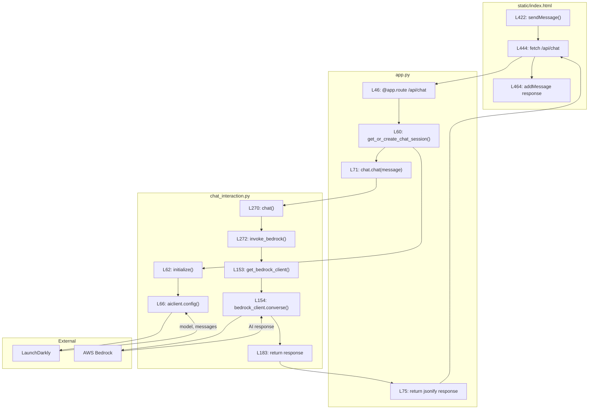

# Detailed Call Flow: /api/chat

This diagram traces a single chat request from user click to AI response, with exact line numbers.

## Step-by-Step with Line Numbers

| Step | File | Line | What Happens |
|------|------|------|--------------|
| 1 | `index.html` | 422 | User clicks Send → `sendMessage()` called |
| 2 | `index.html` | 444 | `fetch('/api/chat', {...})` sends POST request |
| 3 | `app.py` | 46 | Flask route `/api/chat` receives request |
| 4 | `app.py` | 60 | `get_or_create_chat_session()` called |
| 5 | `chat_interaction.py` | 62 | `ChatInteraction.initialize()` called |
| 6 | `chat_interaction.py` | 66 | `aiclient.config()` fetches AI Config from LaunchDarkly |
| 7 | `app.py` | 71 | `chat.chat(message)` called |
| 8 | `chat_interaction.py` | 270 | `chat()` method called |
| 9 | `chat_interaction.py` | 272 | `invoke_bedrock()` called |
| 10 | `chat_interaction.py` | 153 | `get_bedrock_client()` creates AWS client |
| 11 | `chat_interaction.py` | 154 | `bedrock_client.converse()` calls AWS Bedrock |
| 12 | `chat_interaction.py` | 183 | Response returned from `invoke_bedrock()` |
| 13 | `app.py` | 75 | `jsonify()` sends JSON response to frontend |
| 14 | `index.html` | 464 | `addMessage()` displays AI response in chat |
