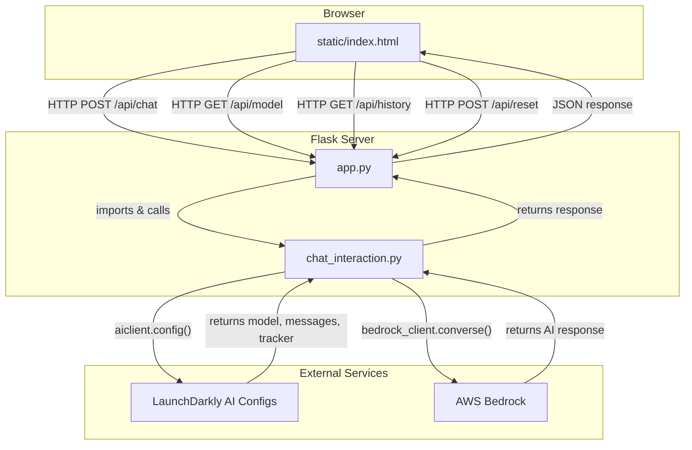

# File Flow Diagram

This diagram shows how files in the project call each other.

## File Responsibilities

| File | Role |
|------|------|
| `static/index.html` | Frontend UI, sends HTTP requests, displays chat |
| `app.py` | Flask server, routes, session management |
| `chat_interaction.py` | LaunchDarkly SDK init, Bedrock calls, conversation history |
| `.env` | Environment variables (SDK keys, AWS config) |

## Call Sequence (simplified)

1. **User types message** → `index.html`
2. **POST /api/chat** → `app.py`
3. **get_or_create_chat_session()** → `app.py` calls `ChatInteraction` from `chat_interaction.py`
4. **aiclient.config()** → `chat_interaction.py` fetches AI Config from LaunchDarkly
5. **invoke_bedrock()** → `chat_interaction.py` calls AWS Bedrock with messages
6. **Response flows back** → `chat_interaction.py` → `app.py` → `index.html`
