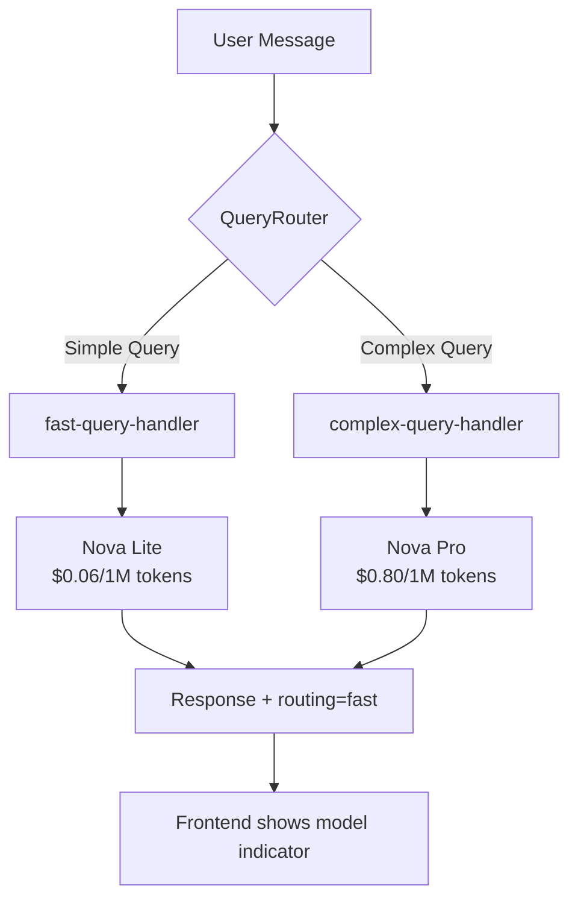

# Query Router - Pseudo Code & Logic Flow

> **Purpose**: Educational document explaining the Query Router implementation before coding.
> **Use Case**: Use Case 2 from LaunchDarkly AI Configs Tutorial - Fast vs Strong Model Routing

---

## Table of Contents

- [Overview](#overview)
- [Visual Flow Diagram](#visual-flow-diagram)
- [Part 1: Query Router Class](#part-1-query-router-class)
- [Part 2: Modified ChatInteraction Class](#part-2-modified-chatinteraction-class)
- [Part 3: App.py Changes](#part-3-apppy-changes)
- [Part 4: Frontend Changes](#part-4-frontend-changes-optional)
- [End-to-End Flow Summary](#end-to-end-flow-summary)

---

## Overview

```
┌─────────────────────────────────────────────────────────────────┐
│                        USER SENDS MESSAGE                        │
│                     "What is 2+2?" (simple)                      │
│              "Explain quantum computing" (complex)               │
└─────────────────────────────────────────────────────────────────┘
                              │
                              ▼
┌─────────────────────────────────────────────────────────────────┐
│                      QUERY ROUTER                                │
│                                                                  │
│  1. Analyze the question                                         │
│  2. Check for complex keywords (explain, why, compare...)        │
│  3. Check word count (> 10 words = complex)                      │
│  4. Return: SIMPLE or COMPLEX                                    │
└─────────────────────────────────────────────────────────────────┘
                              │
              ┌───────────────┴───────────────┐
              │                               │
              ▼                               ▼
┌─────────────────────┐         ┌─────────────────────┐
│   SIMPLE QUERY      │         │   COMPLEX QUERY     │
│                     │         │                     │
│ Config: fast-query  │         │ Config: complex-    │
│ Model: Nova Lite    │         │ Model: Nova Pro     │
│ Cost: $0.06/1M      │         │ Cost: $0.80/1M      │
│ Speed: Fast         │         │ Speed: Slower       │
└─────────────────────┘         └─────────────────────┘
              │                               │
              └───────────────┬───────────────┘
                              ▼
┌─────────────────────────────────────────────────────────────────┐
│                     RESPONSE TO USER                             │
│              + Metadata: which model was used                    │
└─────────────────────────────────────────────────────────────────┘
```

---

## Visual Flow Diagram



---

## Part 1: Query Router Class

```python
# ============================================================================
# QUERY ROUTER - Determines which AI Config to use based on query complexity
# ============================================================================

from enum import Enum
from typing import Tuple

class QueryComplexity(Enum):
    """
    WHY ENUM?
    - Type safety: Can only be SIMPLE or COMPLEX, nothing else
    - Clear intent: Code reads like English
    - IDE support: Autocomplete and error checking
    
    SIMPLE = queries that can be answered quickly with short responses
    COMPLEX = queries requiring detailed analysis, comparisons, explanations
    """
    SIMPLE = "simple"
    COMPLEX = "complex"


class QueryRouter:
    """
    PURPOSE:
    This class analyzes user questions and decides:
    - Should we use the FAST model (cheap, quick)?
    - Should we use the STRONG model (expensive, detailed)?
    
    WHY DO THIS?
    - Cost savings: Simple questions don't need expensive models
    - Speed: Fast model responds quicker for simple queries
    - User experience: Right tool for the right job
    
    EXAMPLE:
    - "What is 2+2?" → SIMPLE → Nova Lite (cheap & fast)
    - "Explain quantum entanglement" → COMPLEX → Nova Pro (detailed)
    """
    
    # -------------------------------------------------------------------------
    # CONFIGURATION: Keywords that indicate a complex query
    # -------------------------------------------------------------------------
    COMPLEX_KEYWORDS: Tuple[str, ...] = (
        'explain',      # User wants explanation → needs detail
        'why',          # User wants reasoning → needs analysis
        'how does',     # User wants mechanism → needs depth
        'compare',      # User wants comparison → needs multiple perspectives
        'analyze',      # User explicitly wants analysis
        'detailed',     # User explicitly wants detail
        'difference',   # User wants contrast → needs comparison
        'describe',     # User wants description → needs elaboration
        'elaborate',    # User explicitly wants more
    )
    
    # If question has more than this many words, treat as complex
    WORD_COUNT_THRESHOLD: int = 10
    
    # -------------------------------------------------------------------------
    # METHOD: classify_query
    # -------------------------------------------------------------------------
    @classmethod
    def classify_query(cls, question: str) -> QueryComplexity:
        """
        WHAT IT DOES:
        Takes a user's question and returns SIMPLE or COMPLEX
        
        HOW IT DECIDES:
        1. Convert question to lowercase (for case-insensitive matching)
        2. Check if any complex keywords are present
        3. Check if the question is longer than threshold
        4. If either is true → COMPLEX, else → SIMPLE
        
        WHY @classmethod?
        - No instance state needed (stateless)
        - Can call without creating an object: QueryRouter.classify_query(...)
        - More efficient than instance methods for utility functions
        
        EXAMPLES:
        - "What is 2+2?" → no keywords, 4 words → SIMPLE
        - "Explain machine learning" → has "explain" → COMPLEX
        - "What is the capital city of the United Kingdom of Great Britain?" 
          → 12 words → COMPLEX (even without keywords)
        """
        
        # Step 1: Normalize the question for comparison
        question_lower = question.lower()
        
        # Step 2: Check for complex keywords
        # any() returns True if ANY keyword is found in the question
        has_complex_keyword = any(
            keyword in question_lower 
            for keyword in cls.COMPLEX_KEYWORDS
        )
        
        if has_complex_keyword:
            return QueryComplexity.COMPLEX
        
        # Step 3: Check word count
        # split() breaks "Hello world" into ["Hello", "world"]
        # len() counts the words
        word_count = len(question.split())
        
        if word_count > cls.WORD_COUNT_THRESHOLD:
            return QueryComplexity.COMPLEX
        
        # Step 4: Default to simple if no complexity indicators
        return QueryComplexity.SIMPLE
    
    # -------------------------------------------------------------------------
    # METHOD: get_config_key
    # -------------------------------------------------------------------------
    @classmethod
    def get_config_key(
        cls, 
        question: str, 
        fast_key: str, 
        strong_key: str
    ) -> Tuple[str, str]:
        """
        WHAT IT DOES:
        Returns the appropriate LaunchDarkly AI Config key based on complexity
        
        PARAMETERS:
        - question: The user's message
        - fast_key: Config key for fast model (e.g., "fast-query-handler")
        - strong_key: Config key for strong model (e.g., "chat-assistant-config")
        
        RETURNS:
        - Tuple of (config_key, routing_label)
        - routing_label is for logging/UI: "fast" or "strong"
        
        EXAMPLE:
        config_key, routing = QueryRouter.get_config_key(
            "What is 2+2?",
            "fast-query-handler",
            "chat-assistant-config"
        )
        # Result: ("fast-query-handler", "fast")
        """
        
        complexity = cls.classify_query(question)
        
        if complexity == QueryComplexity.SIMPLE:
            return (fast_key, "fast")
        else:
            return (strong_key, "strong")
```

---

## Part 2: Modified ChatInteraction Class

```python
# ============================================================================
# CHAT INTERACTION - Modified to support query routing
# ============================================================================

class ChatInteraction:
    """
    WHAT CHANGED:
    Previously: Always used ONE AI Config for ALL queries
    Now: Can route to FAST or STRONG config based on query
    
    BACKWARD COMPATIBLE:
    If fast_config_key is not provided, behaves exactly like before
    """
    
    def __init__(
        self, 
        user_context: Context, 
        ai_config_key: str,           # REQUIRED: Strong model config
        fast_config_key: str = None,  # OPTIONAL: Fast model config
        judge_config_key: str = None
    ):
        """
        INITIALIZATION LOGIC:
        
        1. Store the user context (who is this user?)
        2. Store BOTH config keys (strong is always required)
        3. If fast_config_key is None → routing is DISABLED
        4. Initialize conversation history as empty list
        
        WHY OPTIONAL fast_config_key?
        - Existing code doesn't break (backward compatible)
        - Can enable routing by just adding env variable
        - Graceful degradation: if fast config fails, use strong
        """
        
        self.user_context = user_context
        self.strong_config_key = ai_config_key      # Always available
        self.fast_config_key = fast_config_key      # May be None
        self.judge_config_key = judge_config_key
        
        # Routing enabled only if fast config is provided
        self.routing_enabled = fast_config_key is not None
        
        # Cache for configs (avoid fetching same config repeatedly)
        self._config_cache = {}
        
        self.conversation_history = []
    
    # -------------------------------------------------------------------------
    # METHOD: _get_config_for_query (NEW)
    # -------------------------------------------------------------------------
    def _get_config_for_query(self, question: str):
        """
        WHAT IT DOES:
        Decides which AI Config to use for this specific question
        
        FLOW:
        1. If routing is disabled → use strong config (like before)
        2. If routing is enabled → ask QueryRouter to decide
        3. Fetch the appropriate config from LaunchDarkly
        4. Return config + routing info for response metadata
        
        WHY FETCH CONFIG PER QUERY?
        - Each config has its own tracker
        - Metrics are tracked per-config (cost attribution)
        - LaunchDarkly can update configs without restart
        
        CACHING CONSIDERATION:
        - Could cache configs for performance
        - But then miss config updates from LaunchDarkly
        - Trade-off: freshness vs. performance
        """
        
        # Determine which config key to use
        if not self.routing_enabled:
            # No routing - use strong config for everything
            config_key = self.strong_config_key
            routing = "strong"
        else:
            # Routing enabled - let QueryRouter decide
            config_key, routing = QueryRouter.get_config_key(
                question,
                self.fast_config_key,
                self.strong_config_key
            )
        
        # Fetch config from LaunchDarkly
        # This gets: model name, system prompt, parameters, AND tracker
        fallback = AICompletionConfigDefault(enabled=False)
        config = aiclient.completion_config(
            config_key, 
            self.user_context, 
            fallback
        )
        
        # Get tracker from config for metrics
        tracker = config.tracker
        
        return config, tracker, routing
    
    # -------------------------------------------------------------------------
    # METHOD: send_message (MODIFIED)
    # -------------------------------------------------------------------------
    def send_message(self, user_message: str) -> dict:
        """
        WHAT CHANGED:
        Before: Used self.config (set once during init)
        After: Gets config dynamically based on query complexity
        
        FLOW:
        1. User sends message
        2. Determine which config to use (fast or strong)
        3. Fetch that config from LaunchDarkly
        4. Build messages for Bedrock (system + history + user message)
        5. Call Bedrock with the config's model
        6. Track metrics (success, duration, tokens) to the RIGHT tracker
        7. Return response with routing metadata
        
        WHY RETURN ROUTING INFO?
        - Frontend can show which model answered
        - Debugging: understand why a response was fast/slow
        - Analytics: track routing distribution
        """
        
        # Step 1: Get the right config for this query
        config, tracker, routing = self._get_config_for_query(user_message)
        
        # Log for debugging
        print(f"Query routed to: {routing} (model: {config.model.name})")
        
        # Step 2: Check if config is enabled
        if not config.enabled:
            return {
                "response": "AI Config is disabled",
                "routing": routing,
                "error": True
            }
        
        # Step 3: Build messages for Bedrock
        # Get system messages from THIS config (may differ between fast/strong)
        system_messages = [
            {"text": msg.content} 
            for msg in config.messages 
            if msg.role == "system"
        ]
        
        # Add conversation history + new user message
        messages = self.conversation_history + [
            {"role": "user", "content": [{"text": user_message}]}
        ]
        
        # Step 4: Call Bedrock
        start_time = time.time()
        
        try:
            response = bedrock_client.converse(
                modelId=config.model.name,  # This is different per config!
                system=system_messages,
                messages=messages
            )
            
            # Step 5: Track SUCCESS metrics
            duration_ms = int((time.time() - start_time) * 1000)
            
            if tracker:
                tracker.track_success()
                tracker.track_duration(duration_ms)
                
                usage = response.get('usage', {})
                tracker.track_tokens(TokenUsage(
                    total=usage.get('inputTokens', 0) + usage.get('outputTokens', 0),
                    input=usage.get('inputTokens', 0),
                    output=usage.get('outputTokens', 0)
                ))
            
            # Extract response text
            assistant_message = response['output']['message']['content'][0]['text']
            
            # Update conversation history
            self.conversation_history.append(
                {"role": "user", "content": [{"text": user_message}]}
            )
            self.conversation_history.append(
                {"role": "assistant", "content": [{"text": assistant_message}]}
            )
            
            # Step 6: Return response with metadata
            return {
                "response": assistant_message,
                "routing": routing,                    # "fast" or "strong"
                "model_name": config.model.name,      # "amazon.nova-lite-v1:0"
                "duration_ms": duration_ms,
                "tokens": response.get('usage', {})
            }
            
        except Exception as e:
            # Track ERROR metrics
            if tracker:
                tracker.track_error()
                tracker.track_duration(int((time.time() - start_time) * 1000))
            
            return {
                "response": f"Error: {str(e)}",
                "routing": routing,
                "error": True
            }
```

---

## Part 3: App.py Changes

```python
# ============================================================================
# APP.PY - Environment variables and API changes
# ============================================================================

# ENVIRONMENT VARIABLES
# ---------------------
# Required: The strong model config (used for complex queries, or all queries if no fast config)
AI_CONFIG_KEY = os.getenv("LAUNCHDARKLY_AI_CONFIG_KEY", "chat-assistant-config")

# Optional: The fast model config (if set, enables smart routing)
# If not set → None → routing disabled → all queries go to AI_CONFIG_KEY
FAST_CONFIG_KEY = os.getenv("LAUNCHDARKLY_FAST_CONFIG_KEY")  # None if not set


# CREATE CHAT SESSION
# -------------------
def get_or_create_chat_session(session_id: str, user_id: str, email: str):
    """
    WHAT CHANGED:
    Now passes BOTH config keys to ChatInteraction
    
    If FAST_CONFIG_KEY is None:
    - routing_enabled = False
    - All queries use AI_CONFIG_KEY (strong model)
    - Behavior is identical to before
    
    If FAST_CONFIG_KEY is set:
    - routing_enabled = True
    - Simple queries → FAST_CONFIG_KEY (Nova Lite)
    - Complex queries → AI_CONFIG_KEY (Nova Pro)
    """
    
    if session_id not in chat_sessions:
        # Build user context
        context = Context.builder(user_id).set("email", email).build()
        
        # Create chat with BOTH config keys
        chat = ChatInteraction(
            user_context=context,
            ai_config_key=AI_CONFIG_KEY,        # Strong model (required)
            fast_config_key=FAST_CONFIG_KEY,    # Fast model (optional)
            judge_config_key=JUDGE_CONFIG_KEY
        )
        
        chat.initialize()
        chat_sessions[session_id] = chat
    
    return chat_sessions[session_id]


# API RESPONSE
# ------------
@app.route('/api/chat', methods=['POST'])
def chat():
    """
    WHAT CHANGED:
    Response now includes routing metadata
    
    BEFORE:
    {
        "response": "2+2 equals 4",
        "model_info": {...}
    }
    
    AFTER:
    {
        "response": "2+2 equals 4",
        "routing": "fast",                    # NEW: which path was taken
        "model_used": "amazon.nova-lite-v1:0", # NEW: actual model name
        "model_info": {...}
    }
    """
    
    data = request.json
    message = data.get('message')
    session_id = data.get('session_id', 'default')
    
    chat = get_or_create_chat_session(session_id, user_id, email)
    result = chat.send_message(message)
    
    return jsonify({
        "response": result["response"],
        "routing": result.get("routing"),           # "fast" or "strong"
        "model_used": result.get("model_name"),     # Actual model ID
        "duration_ms": result.get("duration_ms"),
        # ... other fields
    })
```

---

## Part 4: Frontend Changes (Optional)

```javascript
// ============================================================================
// FRONTEND - Display routing indicator
// ============================================================================

// WHEN RESPONSE IS RECEIVED:
function displayMessage(response) {
    // Create message element
    const messageDiv = document.createElement('div');
    
    // Add routing indicator
    // ⚡ = fast model (cheap, quick)
    // 🧠 = strong model (detailed, thorough)
    const routingIcon = response.routing === 'fast' ? '⚡' : '🧠';
    const routingLabel = response.routing === 'fast' ? 'Nova Lite' : 'Nova Pro';
    
    messageDiv.innerHTML = `
        <div class="message assistant">
            <span class="routing-badge">${routingIcon} ${routingLabel}</span>
            <p>${response.response}</p>
        </div>
    `;
    
    chatContainer.appendChild(messageDiv);
}

// WHY SHOW THIS?
// - Transparency: User sees which model answered
// - Learning: User understands why some responses are faster
// - Debugging: Easy to verify routing is working
```

---

## End-to-End Flow Summary

```
1. USER TYPES: "What is 2+2?"
                    │
2. APP.PY receives request
                    │
3. ChatInteraction.send_message("What is 2+2?")
                    │
4. QueryRouter.classify_query("What is 2+2?")
   - No complex keywords found
   - Word count = 4 (< 10)
   - Returns: SIMPLE
                    │
5. get_config_key() returns "fast-query-handler"
                    │
6. aiclient.completion_config("fast-query-handler", ...)
   - Fetches config from LaunchDarkly
   - Config has: model=nova-lite, prompt="answer briefly"
                    │
7. bedrock.converse(modelId="amazon.nova-lite-v1:0", ...)
   - Calls Nova Lite (fast, cheap)
                    │
8. tracker.track_success(), track_duration(), track_tokens()
   - Metrics go to "fast-query-handler" config in LD
                    │
9. Response returned: {"response": "4", "routing": "fast"}
                    │
10. Frontend shows: ⚡ Nova Lite: "4"
```

---

## Test Cases

| Query | Expected Routing | Why |
|-------|------------------|-----|
| "What is 2+2?" | fast | No keywords, short |
| "Hi" | fast | No keywords, very short |
| "What's the capital of France?" | fast | No keywords, 5 words |
| "Explain machine learning" | strong | Has "explain" |
| "Why is the sky blue?" | strong | Has "why" |
| "Compare Python and JavaScript" | strong | Has "compare" |
| "What is the detailed history of..." | strong | Has "detailed" |
| "Tell me about cats dogs birds fish and more animals" | strong | 11 words (> 10) |

---

## Cost Impact

| Scenario | Before (All Nova Pro) | After (With Routing) |
|----------|----------------------|----------------------|
| 1000 queries (70% simple) | $0.80/1M × all | 70% × $0.06 + 30% × $0.80 |
| Estimated savings | - | ~60-70% cost reduction |

---

*Document created for learning the Query Router implementation before coding.*
